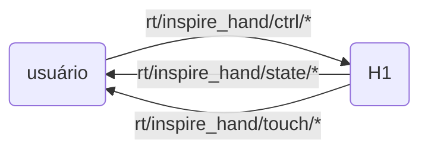

# Introdução ao SDK da Mão Robótica Inspire FTP

O H1 pode ser equipado com a mão robótica de cinco dedos humanóide da [Inspire Robotics](https://inspire-robots.com/product/frwz/), que possui 6 graus de liberdade e 12 articulações de movimento, além de integrar 17 sensores táteis, capaz de simular movimentos complexos da mão humana.

## Método de Controle

A Inspire Robotics fornece oficialmente duas formas de comunicação: ModBusRTU via serial 485 e ModbusTCP. Este SDK utiliza ModbusTCP para se comunicar com a mão robótica, convertendo dados e comandos de controle para o formato DDS.

O H1 fornece um módulo conversor USB-serial, que o usuário pode conectar na unidade de computação de desenvolvimento do H1 (PC2, PC3) para controlar a mão via comunicação 485. Nesse caso, a porta geralmente é /dev/ttyUSB0. Neste modo, é possível usar a versão antiga do SDK para comunicação, mas não há suporte para obtenção de dados dos sensores táteis. Esta versão do SDK não suporta comunicação serial 485.

1. **Controle usando o SDK oficial da Inspire**

O usuário pode escrever seu próprio programa para controlar a mão robótica de acordo com o protocolo de comunicação oficial da Inspire.

2. **Controle usando o SDK da Unitree para mão robótica**

A comunicação do H1 é baseada no framework DDS. Para facilitar o uso do unitree_sdk2 para controlar a mão robótica, a Unitree fornece programas de exemplo que convertem dados recebidos/enviados via ModbusTCP em mensagens DDS (link de download no final do documento).

## Descrição da Interface do SDK Unitree

O usuário envia mensagens `"inspire::inspire_hand_ctrl"` para o tópico `"rt/inspire_hand/ctrl/*"` para controlar a mão robótica.
Recebe mensagens `"inspire::inspire_hand_state"` do tópico `"rt/inspire_hand/state/*"` para obter o estado da mão robótica.
Recebe mensagens `"inspire::inspire_hand_touch"` do tópico `"rt/inspire_hand/touch/*"` para obter dados dos sensores táteis.
Onde `*` é o sufixo do tópico, padrão é `r`, representando a mão direita.



## Formato de Dados IDL

Utiliza formato de array para dados dos motores, contendo dados de 12 motores de ambas as mãos. Para o formato específico de MotorCmd_.idl e MotorState_.idl, consulte [Interface de Serviços Básicos](https://support.unitree.com/home/zh/H1_developer/Basic_Services_Interface)

O formato de dados da mão robótica é basicamente o mesmo que o documento oficial da Inspire. Para detalhes, consulte os arquivos `.idl` em `inspire_hand_sdk/hand_idl`.

```cpp
//inspire_hand_ctrl.idl
module inspire
{
    struct inspire_hand_ctrl
    {
        sequence<int16,6>  pos_set;      // Posição desejada
        sequence<int16,6>  angle_set;    // Ângulo desejado
        sequence<int16,6>  force_set;    // Força desejada
        sequence<int16,6>  speed_set;    // Velocidade desejada
        int8 mode;                       // Modo de controle
    };
};

//inspire_hand_state.idl
module inspire
{
    struct inspire_hand_state
    {
        sequence<int16,6>  pos_act;      // Posição atual
        sequence<int16,6>  angle_act;    // Ângulo atual
        sequence<int16,6>  force_act;    // Força atual
        sequence<int16,6>  current;      // Corrente
        sequence<uint8,6>  err;          // Erro
        sequence<uint8,6>  status;       // Status
        sequence<uint8,6>  temperature;  // Temperatura
    };
};

//inspire_hand_touch.idl
module inspire
{
    struct inspire_hand_touch
    {
        sequence<int16,9>   fingerone_tip_touch;      // Dados táteis da ponta do dedo mínimo
        sequence<int16,96>  fingerone_top_touch;      // Dados táteis do topo do dedo mínimo
        sequence<int16,80>  fingerone_palm_touch;     // Dados táteis da palma do dedo mínimo
        sequence<int16,9>   fingertwo_tip_touch;      // Dados táteis da ponta do dedo anular
        sequence<int16,96>  fingertwo_top_touch;      // Dados táteis do topo do dedo anular
        sequence<int16,80>  fingertwo_palm_touch;     // Dados táteis da palma do dedo anular
        sequence<int16,9>   fingerthree_tip_touch;    // Dados táteis da ponta do dedo médio
        sequence<int16,96>  fingerthree_top_touch;    // Dados táteis do topo do dedo médio
        sequence<int16,80>  fingerthree_palm_touch;   // Dados táteis da palma do dedo médio
        sequence<int16,9>   fingerfour_tip_touch;     // Dados táteis da ponta do dedo indicador
        sequence<int16,96>  fingerfour_top_touch;     // Dados táteis do topo do dedo indicador
        sequence<int16,80>  fingerfour_palm_touch;    // Dados táteis da palma do dedo indicador
        sequence<int16,9>   fingerfive_tip_touch;     // Dados táteis da ponta do polegar
        sequence<int16,96>  fingerfive_top_touch;     // Dados táteis do topo do polegar
        sequence<int16,9>   fingerfive_middle_touch;  // Dados táteis do meio do polegar
        sequence<int16,96>  fingerfive_palm_touch;    // Dados táteis da palma do polegar
        sequence<int16,112> palm_touch;               // Dados táteis da palma da mão
    };
};
```

!!! note "Modos de Controle"
    A mensagem de controle inclui opções de modo. O modo combinado de comandos de controle é implementado de forma binária:

    - mode 0: 0000 (sem operação)
    - mode 1: 0001 (ângulo)
    - mode 2: 0010 (posição)
    - mode 3: 0011 (ângulo + posição)
    - mode 4: 0100 (controle de força)
    - mode 5: 0101 (ângulo + força)
    - mode 6: 0110 (posição + força)
    - mode 7: 0111 (ângulo + posição + força)
    - mode 8: 1000 (velocidade)
    - mode 9: 1001 (ângulo + velocidade)
    - mode 10: 1010 (posição + velocidade)
    - mode 11: 1011 (ângulo + posição + velocidade)
    - mode 12: 1100 (força + velocidade)
    - mode 13: 1101 (ângulo + força + velocidade)
    - mode 14: 1110 (posição + força + velocidade)
    - mode 15: 1111 (ângulo + posição + força + velocidade)

### Ordem das Articulações no IDL

<div style="text-align: center;">
<table border="1">
  <tr>
    <td>Id</td>
    <td>0</td>
    <td>1</td>
    <td>2</td>
    <td>3</td>
    <td>4</td>
    <td>5</td>
  <tr>
    <td rowspan="2">Articulação</td>
    <td colspan="6">Mão</td>
  </tr>
  <tr>
    <td>mínimo</td>
    <td>anular</td>
    <td>médio</td>
    <td>indicador</td>
    <td>polegar-flexão</td>
    <td>polegar-rotação</td>
  </tr>
</table>
</div>

---

# Instalação e Uso do SDK

Este SDK é implementado principalmente em Python, e depende do [`unitree_sdk2_python`](https://github.com/unitreerobotics/unitree_sdk2_python), além de utilizar pyqt5 e pyqtgraph para visualização.

Primeiro, clone o diretório de trabalho do SDK:

```bash
git clone https://github.com/NaCl-1374/inspire_hand_ws.git
```

É recomendado usar `venv` para gerenciar o ambiente virtual:

```bash
python -m venv venv
source venv/bin/activate  # Linux/MacOS
# ou
venv\Scripts\activate  # Windows
```

## Instalação de Dependências

1. Instalar dependências do projeto:

    ```bash
    pip install -r requirements.txt
    ```

2. Atualizar submódulos:

    ```bash
    git submodule init  # Inicializar submódulos
    git submodule update  # Atualizar submódulos para a versão mais recente
    ```

3. Instalar os dois SDKs separadamente:

    ```bash
    cd unitree_sdk2_python
    pip install -e .

    cd ../inspire_hand_sdk
    pip install -e .
    ```

## Uso

## Configuração da Mão Robótica e Ambiente

Primeiro, configure a rede do dispositivo. O IP padrão da mão robótica é: `192.168.11.210`. O segmento de rede do dispositivo precisa estar na mesma sub-rede da mão robótica. Após a configuração, execute `ping 192.168.11.210` para verificar se a comunicação está normal.

Se precisar ajustar o IP da mão robótica e outros parâmetros, você pode executar o **Painel de Configuração da Mão Robótica** mencionado nos exemplos de uso abaixo para iniciar o painel de configuração.
Após iniciar o painel, ele lerá automaticamente as informações do dispositivo na rede atual. Depois de modificar os parâmetros no painel, você precisa clicar em `Escrever Configurações` para enviar os parâmetros para a mão robótica. Neste momento, os parâmetros ainda não entrarão em vigor. Para que entrem em vigor, você precisa clicar em `Salvar Configurações` e reiniciar.

!!! note "Importante"
    Se modificar o IP, você precisa modificar o seguinte código nos arquivos relacionados, alterando a opção IP para o novo IP:

    ``` python
        # inspire_hand_sdk/example/Vision_driver.py e inspire_hand_sdk/example/Headless_driver.py
        handler=inspire_sdk.ModbusDataHandler(ip=inspire_hand_defaut.defaut_ip,LR='r',device_id=1)

        # inspire_hand_sdk/example/init_set_inspire_hand.py
        window = MainWindow(ip=defaut_ip)
    ```

    A opção `LR` é o parâmetro do sufixo `*` da mensagem DDS, que pode ser definido de acordo com o dispositivo.

### Exemplos de Uso

Abaixo estão instruções de uso para alguns exemplos comuns:

1. **Publicar comandos de controle via DDS**:

    Execute o seguinte script para publicar comandos de controle:
    ```bash
    python inspire_hand_sdk/example/dds_publish.py
    ```

2. **Subscrever estado da mão robótica e dados dos sensores táteis via DDS, com visualização**:

    Execute o seguinte script para subscrever o estado da mão robótica e dados dos sensores, e visualizar os dados:
    ```bash
    python inspire_hand_sdk/example/dds_subscribe.py
    ```

3. **Driver DDS da mão robótica (modo headless/sem interface gráfica)**:

    Use o seguinte script para operação em modo headless:
    ```bash
    python inspire_hand_sdk/example/Headless_driver.py
    ```

4. **Painel de configuração da mão robótica**:

    Execute o seguinte script para usar o painel de configuração da mão robótica:
    ```bash
    python inspire_hand_sdk/example/init_set_inspire_hand.py
    ```

5. **Driver DDS da mão robótica (modo painel)**:

    Use o seguinte script para entrar no modo painel e controlar o driver DDS da mão robótica:
    ```bash
    python inspire_hand_sdk/example/Vision_driver.py
    ```

6. **Publicar comandos de controle via DDS em C++**:

    Execute os seguintes comandos para compilar e executar o programa de exemplo:
    ```bash
    cd inspire_hand_sdk
    mkdir build && cd build
    cmake ..
    make
    ./hand_dds
    ```

!!! note "Múltiplas Mãos"
    Se estiver usando múltiplas mãos robóticas, você pode copiar código similar ao seguinte, duplicar as classes correspondentes e redefinir as opções `ip` e `LR`:

    ``` python
        # inspire_hand_sdk/example/Vision_driver.py
        import sys
        from inspire_sdkpy import qt_tabs,inspire_sdk,inspire_hand_defaut

        if __name__ == "__main__":
            # Mão direita
            app_r = qt_tabs.QApplication(sys.argv)
            handler_r=inspire_sdk.ModbusDataHandler(ip='192.168.11.210',LR='r',device_id=1)
            window_r = qt_tabs.MainWindow(data_handler=handler_r,dt=20,name="Hand Vision Driver - Right")
            window_r.reflash()
            window_r.show()
            sys.exit(app_r.exec_())

            # Mão esquerda
            app_l = qt_tabs.QApplication(sys.argv)
            handler_l=inspire_sdk.ModbusDataHandler(ip='192.168.11.211',LR='l',device_id=1)
            window_l = qt_tabs.MainWindow(data_handler=handler_l,dt=20,name="Hand Vision Driver - Left")
            window_l.reflash()
            window_l.show()
            sys.exit(app_l.exec_())
    ```

---
